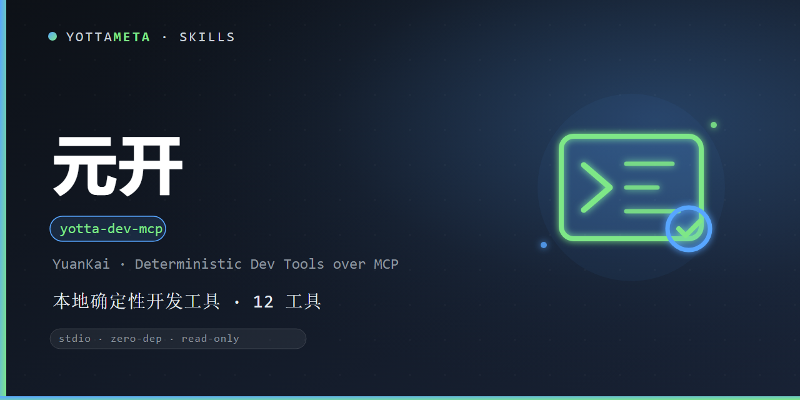

<p align="center"></p>
<h1 align="center">元开（yotta-dev-mcp）</h1>
<p align="center"><b>Language</b>: <a href="README.md">English</a> · 中文</p>

把本地、确定性的开发工具做成 stdio MCP server，任何支持 MCP 的客户端接上即可使用。

## 能做什么

| 工具 | 用途 |
|---|---|
| `repo_map` | 代码库模块、导入关系与入口点地图。 |
| `system_model` | 系统模型：模块、依赖、入口、测试映射、配置与数据归属，附带契约分层。 |
| `architecture_review` | 按契约评审依赖规则、边界可见性与数据归属，逐条给出证据。 |
| `impact_analysis` | 变更影响锥：消费者、受影响层与存储、映射测试、风险分级与回滚探针。 |
| `verify_change` | L0-L5 验证阶梯与证据账本；未执行级别保留在 `unverified_claims`。 |
| `self_test` | 文件、版本、工具契约、写闸门与 seeded defect / mutation 反证自测。 |
| `run_adapter` | 探测或显式运行 import-linter / dependency-cruiser / Repomix 可选适配器。 |
| `find_code` | 符号与文本定位，结果有数量上限。 |
| `compress_output` | 压缩长日志，保留错误、错误栈和首尾上下文。 |
| `review_code` | 规则化代码评审，输出文件、行号、证据与建议。 |
| `review_diff` | 只评审 unified diff 的新增行。 |
| `mcp_doctor` | 只读检查技能目录与 MCP JSON 配置。 |
| `scan_secrets` | 密钥 / 凭据 / 高熵令牌扫描，证据强制脱敏。 |
| `scan_dependencies` | 依赖清单、lockfile、来源与 typosquat 启发式检查。 |
| `check_publish_readiness` | 版本对齐、发布文件与包元数据检查。 |
| `run_checks` | 运行白名单测试 / lint / compile，执行必须显式开启。 |
| `scaffold_skill` | 规划或生成最小技能脚手架，默认 dry-run。 |
| `workflow_state` | 读取 `.workflow`，可选显式追加快照日志。 |

默认只读；`run_checks`、`verify_change` 的 L2-L4 策略检查、`self_test` 的测试子集，
以及 `run_adapter` 的 `action=run` 必须显式 `allow_execute=true`，
`scaffold_skill` / `workflow_state` 必须显式 `apply=true` 才写入。
核心只用 Python 3.8+ 标准库，默认不联网。

### 架构契约

`system_model` 读取可选的 `.yotta/architecture.json`（版本 1），其中声明分层、依赖规则、
边界、数据归属、不变量与风险权重。结果只给 `PASS` / `FAIL` / `UNKNOWN`，把还缺证据的
未知项列进 `unknowns`，未执行的验证级别保留在 `unverified_claims`。schema、glob 规则与
错误码见 `references/architecture-contract.md`。

`architecture_review` 在这份契约上做评审：依赖规则、边界可见性与数据归属逐条产出
文件、行号与严重级；`critical` / `high` 判 FAIL，`medium` / `low` 只告警，
模型无法判定的部分进 `UNKNOWN`，不会被静默放行。

`impact_analysis` 从 `changed_files`、unified diff 或目标符号出发，沿反向依赖走出一棵
有上限的影响锥：直接消费者、受影响层与边界、数据存储、不变量、映射测试、
可解释的风险分级与回滚探针；全程不执行任何命令。

`verify_change` 在改动后跑同一份模型：L0 检查语法与契约 schema，L1 检查影响锥内架构规则，
L2-L4 只执行 `.yotta/verification.json` 中声明的白名单检查且必须显式 `allow_execute=true`，
L5 独立复核始终保留在未验证项。账本中的每个结论都带 claim、status、evidence、check 与
output hash，便于复算；未跑级别不会被写成“已通过”。

`self_test` 对元开自身做完整性检查：必需文件、版本五件、协议工具 schema 与引擎
dispatch 是否漂移、写 / 执行闸门是否仍 fail-closed，并用临时仓库里的 seeded defect
与 mutation control 证明验证器会变红或变 UNKNOWN。测试子集默认不跑。

`run_adapter` 是可选增强层：`action=list` 只探测项目 `node_modules/.bin`、
项目虚拟环境和 `PATH`；`action=run` 必须显式 `allow_execute=true`，且只运行固定
适配器命令。缺工具、缺配置、非法输出或超时都返回 `UNKNOWN` 并给出下一步；
不安装、不下载，适配器结果也不会悄悄改写核心架构工具的状态。详见
`references/adapters.md`。

## 安装

### 启动 MCP server

```bash
npx -y @yottameta/yotta-dev-mcp
```

### 安装技能载荷

```bash
npx -y @yottameta/yotta-dev-mcp --agent codex
npx -y @yottameta/yotta-dev-mcp --dir <技能目录>
npx -y @yottameta/yotta-dev-mcp --list
```

安装器只写入显式目标。`--global` 必须同时给 `--yes`；`--dry-run` 只预览不写入。

其他安装方式：

```bash
git clone https://github.com/YottaMeta/yotta-dev-mcp.git <技能目录>/yotta-dev-mcp
bash <技能目录>/yotta-dev-mcp/install.sh --agent codex
```

也可以使用 GitHub 的 **Download ZIP**，解压到技能目录。

## 直接使用 CLI

```bash
python scripts/dev_engine.py repo-map .
python scripts/dev_engine.py system-model .
python scripts/dev_engine.py architecture-review .
python scripts/dev_engine.py impact-analysis . --changed src/core/store.py
python scripts/dev_engine.py verify-change . --changed src/core/store.py
python scripts/dev_engine.py verify-change . --changed src/core/store.py --level L2 --allow-execute
python scripts/dev_engine.py self-test .
python scripts/dev_engine.py adapter . --action list
python scripts/dev_engine.py adapter . --action run --adapter dependency-cruiser --allow-execute
python scripts/dev_engine.py find-code . "helper"
python scripts/dev_engine.py review-code .
python scripts/dev_engine.py mcp-doctor
```

## 边界

- 不执行代码、不自动改文件、不自动提交。
- 不联网，不查询公共仓库中包是否存在。
- 仅做确定性静态判断，最终评审由人负责。

## 当前版本

`0.2.0`（2026-09-25）在原有十二个确定性工具之上新增 `system_model`、
`architecture_review`、`impact_analysis`、`verify_change`、`self_test`、
`run_adapter`，以及 `.yotta/architecture.json` 与可选
`.yotta/verification.json` 契约（版本 1）。
